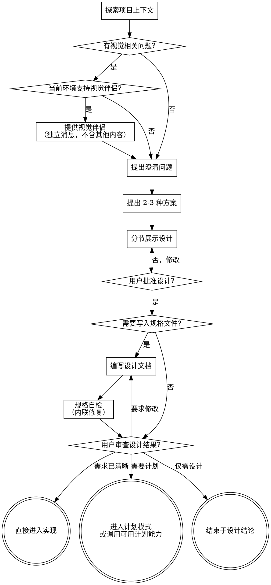

# Brainstorming

## Overview

通过自然的协作对话，帮助将想法转化为清晰、可执行的设计结论。

首先了解当前项目的上下文，然后逐一提问来完善想法。一旦你理解了要构建的内容，就展示设计方案并获得用户批准，再决定是否写入规格、是否进入计划模式或输出实现步骤、是否直接实现。

## Use This Skill

- 需求表述仍然模糊，直接实现很可能返工。
- 存在 2-3 种可行方案，需要先比较权衡再做决定。
- 涉及功能设计、组件设计、页面结构、交互流程、数据流或模块边界。
- 用户明确要求先做方案、设计、规格、原型、思路梳理或头脑风暴。
- 需要在实现前先获得用户对方向的批准。

## Do Not Use

- 用户只是在问一个直接事实、用法说明或单点解释。
- 任务已经有明确实现指令，只需要按要求小范围修改。
- 这是简单的单点修复、文本修改、配置更正或路径调整，且需求没有歧义。
- 用户明确要求跳过设计阶段，直接实现一个边界清晰的小任务。
- 当前步骤只是执行既定计划，而不是探索方案。

## Input Contract

**必需输入：**
- 用户想讨论的问题、目标或待设计对象

**可选但强烈推荐的输入：**
- 当前代码库上下文或相关路径
- 已知约束、非功能需求、边界条件
- 成功标准、验收方式、目标用户
- 是否需要落盘为规格文件

**缺失输入处理：**
- 如果目标本身仍模糊，先通过单问题澄清逐步缩小范围
- 如果用户其实已经给出清晰实现指令，停止设计流程，改为直接实现或转交更合适的 skill
- 如果缺少代码库上下文但仍可先讨论方向，先做概念设计，并明确哪些内容仍待结合仓库确认

## Anti-Pattern: "This is too simple, no design needed"

不要因为任务看起来熟悉就跳过澄清。真正需要这个 Skill 的任务，返工通常来自误解目标、遗漏约束或过早实现。对于小任务，设计可以很短；对于已经清晰的任务，则不应强行套用本 Skill。

## Checklist

你必须为以下每个条目创建任务，并按顺序完成：

1. **探索项目上下文** — 检查文件、文档、最近的变更；若当前目录是 git 仓库且确有帮助，再查看最近的 commit
2. **提供视觉伴侣**（仅当主题本身是视觉问题且当前环境支持时）— 这是一条独立的消息，不要与澄清问题合并。参见下方的"Visual Companion"部分。
3. **提出澄清问题** — 每次一个，了解目的/约束/成功标准
4. **提出 2-3 种方案** — 附带权衡分析和你的推荐
5. **展示设计** — 按复杂度分节展示，每节展示后获得用户批准
6. **选择输出形式** — 根据用户需求决定是内联总结、写入规格文件、输出实现步骤，还是直接实现
7. **规格自检** — 若写入规格，快速内联检查占位符、矛盾、模糊性、范围（详见下方）
8. **用户审查设计结果** — 若写入规格或设计较复杂，在继续前请用户确认
9. **过渡到下一步** — 根据用户意图选择进入计划模式、调用当前环境可用的计划类能力、直接实现，或结束在设计结论

## Flowchart



默认目标是让需求、约束和方案足够清晰，而不是强制把所有任务都送进同一条后续流程。常见下一步是进入计划模式或输出分步骤实现方案，但不是唯一下一步。

## Detailed Workflow

**理解想法：**

- 首先查看当前项目状态（文件、文档、最近的变更；若当前目录是 git 仓库且确有帮助，再查看最近的 commit）
- 在提出详细问题之前，先评估范围：如果需求描述了多个独立子系统（例如"构建一个包含聊天、文件存储、计费和分析的平台"），立即指出这一点。不要花时间用问题去细化一个需要先拆分的项目。
- 如果项目规模过大，单个规格说明无法覆盖，帮助用户分解为子项目：有哪些独立的部分，它们之间有什么关系，应该按什么顺序构建？然后通过正常的设计流程进行第一个子项目的头脑风暴。每个子项目都有自己的规格 → 计划 → 实现周期。
- 对于范围适当的项目，每次提一个问题来完善想法
- 尽量使用选择题，开放式问题也可以
- 每条消息只提一个问题——如果一个主题需要更多探索，拆分成多个问题
- 重点理解：目的、约束、成功标准
- 如果用户已经给出了足够明确的约束和验收标准，可以快速确认后结束在简短设计，而不是强行延长流程

**探索方案：**

- 提出 2-3 种不同的方案及其权衡
- 以对话的方式展示选项，附上你的推荐和理由
- 先展示你推荐的方案并解释原因

**展示设计：**

- 一旦你认为理解了要构建的内容，就展示设计
- 每个部分的篇幅与其复杂度匹配：简单的几句话，复杂的最多 200-300 字
- 每个部分展示后询问是否正确
- 涵盖：架构、组件、数据流、错误处理、测试
- 随时准备回头澄清不明确的地方

**面向隔离和清晰的设计：**

- 将系统拆分为更小的单元，每个单元有一个明确的职责，通过定义良好的接口通信，可以独立理解和测试
- 对于每个单元，你应该能回答：它做什么，如何使用，它依赖什么？
- 别人能否不看内部实现就理解一个单元的功能？你能否在不影响调用者的情况下修改内部实现？如果不能，边界需要调整。
- 更小、边界清晰的单元也更便于你工作——你对能一次放入上下文的代码推理得更好，文件越专注你的编辑越可靠。当文件变大时，这通常意味着它承担了过多职责。

**在现有代码库中工作：**

- 在提出更改之前先探索现有结构。遵循现有模式。
- 如果现有代码存在影响当前工作的问题（例如文件过大、边界不清、职责纠缠），在设计中包含有针对性的改进——就像一个优秀的开发者在工作中改进经手的代码一样。
- 不要提议无关的重构。专注于服务当前目标的事情。

## After Design

- 默认先给出**内联设计摘要**，包括目标、约束、推荐方案、关键结构和下一步建议。
- 只有在用户需要沉淀、多人协作、后续要多轮实现，或你判断复杂度足以受益时，才写入规格文件。
- 如果用户只需要方向确认，不必强制落盘。

**文档（可选）：**

- 将验证通过的设计写入用户认可的位置。默认建议路径可以是 `docs/superpowers/specs/YYYY-MM-DD-<topic>-design.md`，但用户偏好优先。
- 只有在用户明确希望落盘、当前目录可写且这样做确有价值时，才写文件。
- 只有在当前目录本来就是 git 仓库，且用户希望保留版本记录时，才进行 commit。

**规格自检（若已写入规格）：**
编写规格文档后，以全新的视角审视它：

1. **占位符扫描：** 有没有"待定"、"TODO"、未完成的章节或模糊的需求？修复它们。
2. **内部一致性：** 各章节之间有矛盾吗？架构和功能描述匹配吗？
3. **范围检查：** 这是否聚焦到可以用一个实现计划覆盖，还是需要进一步拆分？
4. **模糊性检查：** 有没有需求可以被两种方式理解？如果有，选择一种并明确写出来。

发现问题就直接内联修复。无需重新审查——修好继续推进。

**用户审查关卡：**

- 如果你写入了规格文件，或设计本身较复杂，请用户在继续前审查结果。
- 如果只是简短设计摘要且用户已在对话中确认，可以不再强制增加一个独立审查关卡。

规格自检完成后，可使用类似表述：

> "设计结果已整理到 `<path>`。请审查一下；如果在我们开始计划或实现之前你想做任何修改，请告诉我。"

等待用户回复。如果他们要求修改，做出修改并重新运行规格自检。只有在用户批准后才继续。

**下一步：**

- 如果任务较复杂、需要明确里程碑或风险控制，优先衔接到 `writing-plans`；如果当前环境没有该 skill，再在当前对话中给出详细实现计划。
- 如果任务已经足够清晰且范围很小，可以在得到用户确认后直接实现。所谓"直接实现"是指在当前会话中直接编码，然后走标准收尾流程（`verification-before-completion` → commit 或分支收尾），而非跳过验证。
- 如果用户当前只需要设计结论，则结束在设计摘要或规格文件即可。

## Output Contract

默认输出一份**内联设计摘要**，至少包含：目标、约束、推荐方案、关键结构、风险/待确认点、建议的下一步。

默认使用以下摘要骨架：

```markdown
设计讨论已收敛。

**目标:** [一句话]
**关键约束:**
- [若无则写 `- 无`]

**可选方案:**
- 方案 A: [一句话 + 取舍]
- 方案 B: [一句话 + 取舍]
- 方案 C: [如无则省略]

**推荐方案:**
- [推荐理由]

**关键结构:**
- [模块 / 页面 / 数据流 / 边界]

**风险 / 待确认点:**
- [若无则写 `- 无`]

**下一步:**
- [进入 writing-plans / 直接实现 / 写规格文件 / 结束在设计结论]
```

如果写入规格文件，回复中必须额外给出：写入路径、文档用途、是否已完成规格自检、是否需要用户继续审查。
如果直接实现，先用一句话确认设计已收敛，再切换到实现任务。

## Core Principles

- **每次一个问题** — 不要同时抛出多个问题
- **优先选择题** — 在可能的情况下比开放式问题更容易回答
- **严格遵循 YAGNI** — 从所有设计中移除不必要的功能
- **探索替代方案** — 在做决定之前始终提出 2-3 种方案
- **增量验证** — 展示设计，获得批准后再继续
- **保持灵活** — 有不明确的地方就回头澄清
- **以最小流程达成清晰** — 不为简单且清晰的任务制造额外流程

## Visual Companion

`brainstorming` 附带一个**可选**的浏览器原型工具。用于展示布局、线框图、架构图等视觉内容，让用户直接在浏览器中点击选择。

**提供伴侣：** 当你预计后续问题会涉及视觉内容时，发送一条独立消息邀请用户：
> "我们接下来讨论的一些内容，如果能在浏览器中展示给你看可能会更直观。我可以在讨论过程中为你制作原型、图表、对比图和其他视觉材料。这个功能还比较新，可能会消耗较多 token。要试试吗？（需要打开一个本地 URL）"

**此提议必须是一条独立的消息。** 不要与澄清问题或其他内容合并。用户拒绝则继续纯文本。

**逐问题决策：** 即使用户接受了，也要按"用户看到它是否比读到它更容易理解？"决定每个问题是否用浏览器。

如果用户同意使用伴侣，切换到 `visual-brainstorming` Skill 来管理后续的浏览器交互，完成后交回给 `brainstorming` 继续文字讨论。

如果当前环境不支持本地服务、预览或后台进程，跳过视觉伴侣，继续纯文本头脑风暴。

## Resources

- 示例输入输出：`examples/input.md`、`examples/output.md`
- 评估用例：`evals/evals.json`
- 规格审查模板：`spec-document-reviewer-prompt.md`

## Failure Handling

- 如果无法快速判断是否需要本 Skill，先用一句话确认需求是否已经足够清晰；不要默认强行进入长流程。
- 如果用户不想写规格文件，改为输出内联设计摘要。
- 如果当前目录不是 git 仓库，或用户不希望记录版本，不要强制 commit。
- 如果当前环境不支持视觉伴侣，继续纯文本模式，不要因为缺少浏览器分支而阻塞任务。
- 如果当前环境没有 `writing-plans` 或其他专门的计划类 Skill，直接在当前对话中输出实现计划，不要引用不存在的能力名称。
- 如果用户在过程中改目标，回到澄清问题阶段，重新确认约束和成功标准。

## Integration

- `writing-plans`: Downstream — brainstorming clarifies requirements and design, then hands off to writing-plans for task breakdown before implementation.
- `executing-plans`: Downstream — when the scope is small and confirmed, brainstorming can proceed directly to sequential execution.
- `subagent-driven-development`: Downstream — when the scope is small, confirmed, and tasks are independent, brainstorming can proceed directly to subagent-driven execution.
- `visual-brainstorming`: Optional downstream — if the user accepts the browser companion offer, switch to visual-brainstorming for interactive prototyping, then return to brainstorming for text-based discussion.
